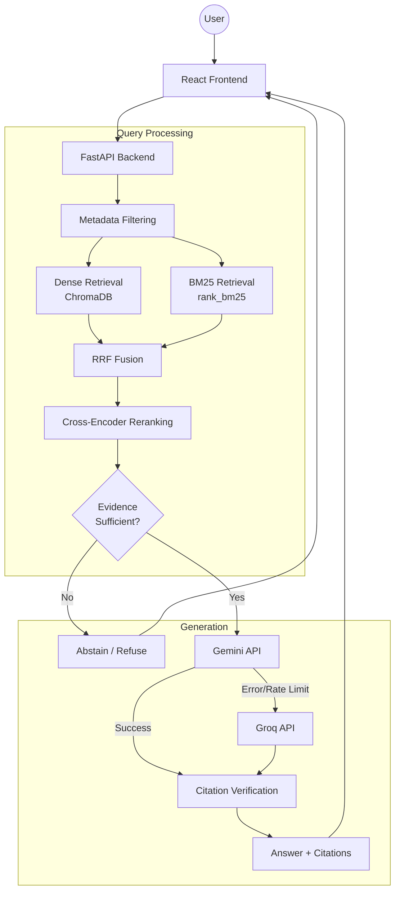
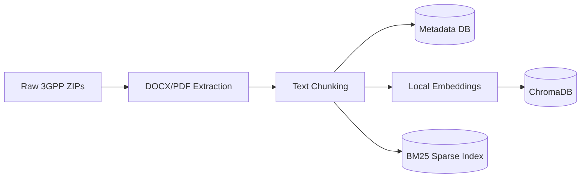

<div align="center">

# TeleRAG

### Mavenir 3GPP Standards Intelligence Assistant

*Evidence-grounded RAG chatbot for querying official 3GPP telecommunications standards*

[](https://python.org)
[](https://fastapi.tiangolo.com)
[](https://react.dev)
[](LICENSE)

</div>

---

## Project Overview

TeleRAG is a production-quality Retrieval-Augmented Generation (RAG) chatbot specialized in 3GPP telecommunications standards. The system is designed with a heavy focus on minimizing unsupported claims. It enforces **abstention** when sufficient evidence is unavailable and validates all LLM citations against retrieved chunks.

## Mavenir Technical Demonstration

This repository is provided as a technical demonstration for Mavenir's Graduate Engineer Trainee evaluation. 

TeleRAG is a technical demonstration of an evidence-grounded RAG assistant for querying 3GPP Release 18 standards. 

It is NOT an official Mavenir internal product. It showcases a deep understanding of RAG architecture, 3GPP/telecom technical documentation workflows, advanced retrieval techniques, and strict evidence grounding.

## Key Features

- **Controlled 3GPP corpus**: Configured for a reproducible baseline of six specific Release 18 specifications.
- **Hybrid dense + BM25 retrieval**: Fuses `all-MiniLM-L6-v2` dense embeddings with `rank_bm25` keyword search.
- **RRF (Reciprocal Rank Fusion)**: Robustly merges dense and sparse rankings.
- **Cross-encoder reranking**: Uses `ms-marco-MiniLM-L-6-v2` for precise semantic candidate reordering.
- **Evidence scoring**: Computes sufficiency scores to block ungrounded claims.
- **Citation validation**: Verifies generated references against original documents.
- **Abstention**: The chatbot securely refuses to answer when evidence fails thresholds.
- **Gemini generation with Groq fallback**: Ensures high availability.
- **Local reproducible indexing**: Evaluators can instantly rebuild vector indexes offline with a single script.

## Architecture



### Ingestion Pipeline


## Current Corpus Scope

The submitted version is intentionally scoped to a controlled Release 18 (Version 18.0.0) baseline consisting of the following six official 3GPP specifications:

- **TS 23.501**: System Architecture for the 5G System
- **TS 23.502**: Procedures for the 5G System
- **TS 23.503**: Policy and Charging Control Framework
- **TS 24.501**: 5G NAS protocol
- **TS 38.300**: NR and NG-RAN overall description
- **TS 38.331**: NR RRC protocol specification

**Rationale:**
1. These specifications cover important 5G Core, NAS, NG-RAN and RRC concepts.
2. They provide a useful technical breadth for a focused RAG demonstration.
3. A controlled baseline avoids mixing historical revisions.
4. Using one consistent Release 18 baseline makes results reproducible.
5. It keeps local indexing and evaluation practical.
6. It demonstrates the architecture without requiring an unnecessarily huge corpus.

The corpus is controlled rather than an unrestricted collection of 3GPP documents. The current ingestion setup does not automatically discover and index arbitrary additional specifications. Additional specifications require explicit ingestion-pipeline/configuration support and appropriate source/version validation. The current implementation should therefore be evaluated using the six documented specifications.

> The reference baseline contains approximately 13,642 chunks. The setup script will calculate and output the exact final chunk count during your local build.

### Future Corpus Expansion

Future versions can extend the corpus-management and ingestion layer to support:
- additional Release 18 specifications
- Release 17
- Release 19
- future 3GPP releases
- larger multi-release corpora

However, this is a planned enhancement and is NOT part of the current v0 implementation. Future expansion would require controlled changes to corpus discovery/configuration, source validation, version/release metadata handling, and indexing.

The retrieval architecture is designed around indexed retrieval rather than passing the entire corpus to the LLM. The submitted v0 evaluation uses the six-document Release 18 baseline. Larger corpora are a future scalability consideration and have not been claimed as part of the current validated setup.

## Dataset

### 3GPP Release 18 Dataset

Dataset download:
https://drive.google.com/drive/folders/1rCBpMn-DUdHOl1BmfYWs4hOZtBNgmYPI?usp=sharing

The evaluator should download and extract the provided corpus into the expected directory before running `setup.py`. The exact directory structure must look like this:

```
data/
  3gpp/
    release_18/
      TS_23.501/
      TS_23.502/
      TS_23.503/
      TS_24.501/
      TS_38.300/
      TS_38.331/
```

## Local Setup

The `setup.py` script automatically handles the local corpus preparation and index generation workflow. Evaluators do not need to manually create ChromaDB, BM25 indexes, SQLite tables, or embeddings.

Follow these steps for the evaluator workflow:

1. Clone repository
```bash
git clone https://github.com/Manvendra9830/Mavenir_Low_Hallucination_Chatbot.git telerag
cd telerag
```

2. Create Python virtual environment
```bash
python -m venv .venv
# On Windows:
.venv\Scripts\activate
# On Mac/Linux:
source .venv/bin/activate
```

3. Install backend dependencies
```bash
pip install -r requirements.txt
```

4. Install frontend dependencies
```bash
cd frontend
npm install
cd ..
```

5. Obtain/place the required 3GPP corpus (from the dataset link).
6. Place it under the documented data directory (`data/3gpp/release_18/`).

## Environment Configuration

7. Configure `.env`

Copy the example configuration:
```bash
cp .env.example .env
# On Windows Command Prompt:
copy .env.example .env
```

Open `.env` and fill in your API keys (like `GEMINI_API_KEY` and `GROQ_API_KEY`).

## Running the Backend

8. Run setup script:
```bash
python scripts/setup.py
```
*(This builds all necessary databases and indexes from the 3GPP corpus)*

9. Start backend:
```bash
python -m uvicorn backend.app.main:app --reload --port 8000
```

## Running the Frontend

10. Start frontend:
Open a second terminal:
```bash
cd frontend
npm run dev
```

11. Open the local frontend URL at http://localhost:5173 in your browser.

## RAG Pipeline

1. **Dense Retrieval:** Captures the semantic intent of your telecom question using `all-MiniLM-L6-v2`.
2. **Sparse BM25:** Matches exact acronyms and specification terminology.
3. **RRF (Reciprocal Rank Fusion):** Combines the ranks of dense and sparse algorithms to identify the best candidates.
4. **Cross-Encoder Reranking:** Re-scores the top candidates using a heavy BERT model to surface the absolute best context.
5. **Evidence Scoring:** The top hits are evaluated for semantic similarity to the query to calculate an "Evidence Score".
6. **LLM Generation:** The LLM is strictly instructed to answer *only* using the verified evidence.
7. **Abstention:** If the evidence score fails the confidence threshold, the chatbot gracefully refuses to answer.

## Grounding and Abstention

This system is explicitly designed to minimize unsupported claims through strict evidence grounding. The system intentionally refuses questions when sufficient evidence cannot be found in the selected corpus.

Example:

**Question:** "What is the maximum throughput of a 6G NR base station?"
**Expected Response:** "I could not find sufficient evidence in the selected 3GPP standards to answer this question."

Additionally, questions about proprietary Mavenir internal implementations are outside the supplied public 3GPP evidence and should therefore be rejected/abstained.

## Evaluation / Demo Questions

Try these questions in the UI to evaluate the RAG pipeline:

1. **What is the role of the AMF in the 5G Core Network?**
   *(Expected: Grounded answer citing TS 23.501)*
2. **What is the role of the SMF in the 5G system architecture?**
   *(Expected: Grounded answer citing TS 23.501 or TS 23.503)*
3. **What is the PDU session establishment procedure?**
   *(Expected: Grounded answer citing TS 23.502 or TS 24.501)*
4. **What does TS 38.331 specify?**
   *(Expected: Grounded answer on NR RRC protocol)*
5. **What is the maximum throughput of a 6G NR base station?**
   *(Expected: Insufficient evidence / abstention)*
6. **What is Mavenir's proprietary internal AMF implementation according to TS 23.501?**
   *(Expected: Insufficient evidence / abstention)*

## Demo Video

### Demo Video

https://drive.google.com/file/d/1ituA_DAmE8keHMiNcAVrVy_4lVwBw4EP/view?usp=sharing

This demo video demonstrates:
- A technical 3GPP question
- Hybrid retrieval
- Grounded answer
- Evidence-backed generation
- Abstention for unsupported/out-of-domain questions
- Gemini primary / Groq fallback where applicable

## Why No Public Deployment?

The project is intentionally provided for local evaluation rather than as a publicly deployed application. The backend requires LLM API credentials through environment variables. To avoid exposing or sharing the developer's personal API credentials through a public deployment, the repository is designed to be run locally using the evaluator's own API keys.

- API keys are never committed to version control.
- API keys belong exclusively in the `.env` file.
- `.env.example` shows the required variables without exposing real keys.
- The frontend never receives the API keys.
- Evaluators can safely run the project locally.

## Security

- **.env** file contains **API credentials** and is used for the **Backend only**.
- Never commit `.env` to version control.
- Never place API keys in frontend code.
- Never expose API keys in screenshots or demo videos.
- `.env.example` contains placeholders only.

## Limitations

- **Release 18 Baseline Only:** The current corpus is restricted to six core specifications for predictability.
- **Local Index Generation:** Re-embedding large libraries relies heavily on CPU speed unless GPU PyTorch is configured.
- **LLM Rate Limits:** Free-tier Gemini and Groq API quotas heavily restrict generation concurrency.
- **No Zero-Hallucination Guarantee:** The system is "designed to minimize unsupported claims", but absolute guarantees are mathematically impossible with stochastic LLMs.

## Future Improvements

- Streaming LLM output to the frontend for faster time-to-first-token.
- Intelligent multi-hop retrieval for queries spanning NAS and RRC procedures simultaneously.
- Asynchronous Celery workers for non-blocking document ingestion in production.

## License / Notes

Project structure for reference:
```text
mavenir/
├── backend/
│   └── app/
│       ├── api/          # FastAPI Routes
│       ├── generation/   # Gemini & Groq clients
│       ├── ingestion/    # PyMuPDF Extractor & Chunker
│       ├── reranking/    # Cross-encoder implementation
│       ├── retrieval/    # Dense, BM25, and Fusion logic
│       ├── services/     # RAG Orchestration (QueryService)
│       └── storage/      # ChromaDB & SQLite Metadata Store
├── data/
│   └── 3gpp/             # Dataset directory
├── frontend/             # React + Vite application
├── scripts/
│   └── setup.py          # One-command ingestion builder
└── storage/              # Generated databases (ignored in Git)
```
