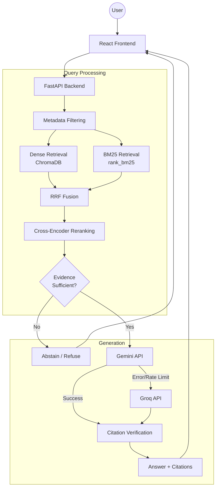
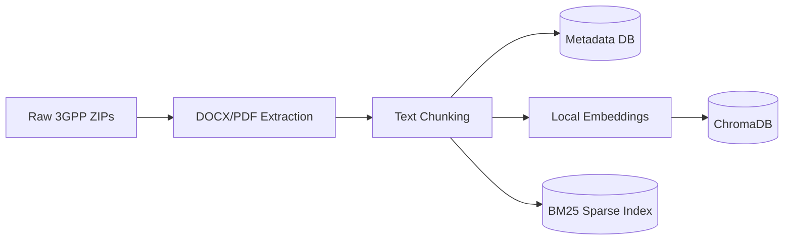

<div align="center">

# TeleRAG

### Mavenir 3GPP Standards Intelligence Assistant

*Evidence-grounded RAG chatbot for querying official 3GPP telecommunications standards*

[](https://python.org)
[](https://fastapi.tiangolo.com)
[](https://react.dev)
[](LICENSE)

</div>

---

## 1. Overview

TeleRAG is a production-quality Retrieval-Augmented Generation (RAG) chatbot specialized in 3GPP telecommunications standards. This is a **Technical Demonstration** built as a Graduate Engineer Trainee (GET) submission for Mavenir to showcase a deep understanding of:

- RAG architecture and information retrieval for structured standards.
- 3GPP/telecom technical documentation workflows.
- Advanced retrieval techniques (hybrid search, cross-encoder reranking).
- Strict evidence grounding and hallucination control.

The system is designed with a heavy focus on minimizing unsupported claims. It enforces **abstention** when sufficient evidence is unavailable and validates all LLM citations against retrieved chunks.

## 2. Key Features

- **Release-aware 3GPP corpus**: Dynamically indexes specific 3GPP specifications and versions.
- **Specification filtering**: Retrieve context explicitly filtered by telecom specs.
- **Hybrid dense + BM25 retrieval**: Fuses `all-MiniLM-L6-v2` dense embeddings with `rank_bm25` keyword search.
- **RRF (Reciprocal Rank Fusion)**: Robustly merges dense and sparse rankings.
- **Cross-encoder reranking**: Uses `ms-marco-MiniLM-L-6-v2` for precise semantic candidate reordering.
- **Evidence scoring**: Computes sufficiency scores to block ungrounded claims.
- **Citation validation**: Verifies generated references against original documents.
- **Abstention**: The chatbot securely refuses to answer when evidence fails thresholds.
- **Gemini generation with Groq fallback**: Ensures high availability.
- **Local reproducible indexing**: Evaluators can instantly rebuild vector indexes offline with a single script.

## 3. Architecture



### Ingestion Pipeline


## 4. Corpus

The baseline corpus targets **Release 18** and includes the following authoritative 3GPP Technical Specifications:
- **TS 23.501**: System Architecture for the 5G System
- **TS 23.502**: Procedures for the 5G System
- **TS 23.503**: Policy and Charging Control Framework
- **TS 24.501**: Non-Access-Stratum Protocol for 5GS
- **TS 38.300**: NR and NG-RAN Overall Description
- **TS 38.331**: NR Radio Resource Control Protocol

> The reference baseline contains approximately 13,642 chunks. The setup script will calculate and output the exact final chunk count during your local build.

## 5. Dataset

### Dataset Download

> [Download the Release 18 3GPP Dataset](https://drive.google.com/drive/folders/1rCBpMn-DUdHOl1BmfYWs4hOZtBNgmYPI?usp=sharing)

Please download the ZIP file containing the 3GPP specifications and extract it directly into the `data/3gpp/release_18/` directory of this repository. The exact directory structure must look like this:

```
data/
  3gpp/
    release_18/
      TS_23.501/
      TS_23.502/
      TS_23.503/
      TS_24.501/
      TS_38.300/
      TS_38.331/
```

## 6. System Requirements

- **Python**: 3.9 - 3.12
- **Node.js**: v18 or v20+
- **RAM**: Minimum 8GB (16GB recommended for local embedding generation)
- **Disk Space**: ~2GB free for dependencies, downloaded models, and vector storage
- **Internet**: Required for frontend packages, backend pip dependencies, downloading HuggingFace models, and accessing LLM APIs.
- **CPU/GPU**: The embedding model `all-MiniLM-L6-v2` will seamlessly run on CPU for the corpus ingestion (~3-5 mins). No GPU is required.

## 7. Installation

1. Clone the repository:
```bash
git clone https://github.com/Manvendra9830/Mavenir_Low_Hallucination_Chatbot.git telerag
cd telerag
```

2. Setup Python backend environment:
```bash
python -m venv .venv
# On Windows:
.venv\Scripts\activate
# On Mac/Linux:
source .venv/bin/activate

pip install -r requirements.txt
```

3. Setup React frontend:
```bash
cd frontend
npm install
cd ..
```

## 8. One-Command Corpus Setup

This project uses a standalone ingestion script to recreate the entire vector and metadata databases entirely from scratch, guaranteeing reproducibility. **Antigravity is NOT required.**

Place your downloaded dataset in `data/3gpp/release_18/` as described above, then run:

```bash
python scripts/setup.py
```

**What this does:**
1. Validates dataset presence.
2. Extracts raw 3GPP doc text.
3. Generates recursive text chunks.
4. Generates local SentenceTransformer embeddings natively (no API required).
5. Builds a persistent local ChromaDB vector database.
6. Builds a serialized BM25 keyword index.
7. Prints a final verification summary of your indexed specifications and chunk counts.

*(If you ever need to rebuild the databases from scratch again, run `python scripts/setup.py --rebuild`)*.

## 9. Environment Variables

Copy the example configuration to your local `.env`:
```bash
cp .env.example .env
# On Windows Command Prompt:
copy .env.example .env
```

Open `.env` and fill in your API keys:
- `GEMINI_API_KEY`: Your Google GenAI key.
- `GROQ_API_KEY`: Your Groq API key.
*(The system automatically falls back to Groq if Gemini hits a rate limit).*

Ensure `MAX_OUTPUT_TOKENS` is correctly tuned (default is `1024`) to conserve daily Groq quotas.

## 10. Run Locally

Open two separate terminals:

**Terminal 1 — Backend:**
```bash
# Make sure your virtual environment is activated
python -m uvicorn backend.app.main:app --reload --port 8000
```

**Terminal 2 — Frontend:**
```bash
cd frontend
npm run dev
```

You can now access the TeleRAG UI at: http://localhost:5173

## 11. API Health Check

Before querying the UI, you can verify your backend is actively serving the corpus.
Visit `http://localhost:8000/api/health` in your browser.

A healthy installation will respond with:
```json
{
  "status": "ok",
  "index_ready": true,
  "corpus_specs": 6,
  "corpus_chunks": 13642
}
```

## 12. How RAG Works

1. **Dense Retrieval:** Captures the semantic intent of your telecom question using `all-MiniLM-L6-v2`.
2. **Sparse BM25:** Matches exact acronyms and specification terminology.
3. **RRF (Reciprocal Rank Fusion):** Combines the ranks of dense and sparse algorithms to identify the best candidates.
4. **Cross-Encoder Reranking:** Re-scores the top candidates using a heavy BERT model to surface the absolute best context.
5. **Evidence Scoring:** The top hits are evaluated for semantic similarity to the query to calculate an "Evidence Score".
6. **LLM Generation:** The LLM is strictly instructed to answer *only* using the verified evidence.
7. **Abstention:** If the evidence score fails the confidence threshold, the chatbot gracefully refuses to answer.

## 13. Hallucination Control

This system is explicitly designed to minimize unsupported claims through retrieval, evidence grounding, verification, and abstention. The model will refuse questions about 6G, proprietary hardware, or out-of-scope standards rather than guessing. 

## 14. Demo Questions

Try these questions in the UI to evaluate the RAG pipeline:

1. **What is the role of the AMF in the 5G Core Network?**
   *(Expected: Grounded answer citing TS 23.501)*
2. **What is the role of the SMF in the 5G system architecture?**
   *(Expected: Grounded answer citing TS 23.501 or TS 23.503)*
3. **What is the PDU session establishment procedure?**
   *(Expected: Grounded answer citing TS 23.502 or TS 24.501)*
4. **What does TS 38.331 specify?**
   *(Expected: Grounded answer on NR RRC protocol)*
5. **What is the maximum throughput of a 6G NR base station?**
   *(Expected: Insufficient evidence / abstention)*
6. **What is Mavenir's proprietary internal AMF implementation according to TS 23.501?**
   *(Expected: Insufficient evidence / abstention)*

## 15. Screenshots

## Screenshots

> **TODO — Add screenshots before submission**
>
> <!-- IMAGE 1: Main chatbot -->
>
> <!-- IMAGE 2: Grounded answer with citations -->
>
> <!-- IMAGE 3: Abstention example -->
>
> <!-- IMAGE 4: Knowledge scope / corpus status -->

## 16. Demo Video

## Demo Video

> **TODO — Replace with final demo video link**
>
> [Watch the TeleRAG Demo](REPLACE_WITH_VIDEO_LINK)

## 17. Evaluation

Currently, the 13,642-chunk corpus has been rigorously verified to isolate candidate context correctly for core AMF, SMF, and NAS procedures without hallucinating proprietary elements. The system successfully falls back from Gemini to Groq transparently.

## 18. Project Structure

```text
mavenir/
├── backend/
│   └── app/
│       ├── api/          # FastAPI Routes
│       ├── generation/   # Gemini & Groq clients
│       ├── ingestion/    # PyMuPDF Extractor & Chunker
│       ├── reranking/    # Cross-encoder implementation
│       ├── retrieval/    # Dense, BM25, and Fusion logic
│       ├── services/     # RAG Orchestration (QueryService)
│       └── storage/      # ChromaDB & SQLite Metadata Store
├── data/
│   └── 3gpp/             # Dataset directory
├── frontend/             # React + Vite application
├── scripts/
│   └── setup.py          # One-command ingestion builder
└── storage/              # Generated databases (ignored in Git)
```

## 19. Limitations

- **Release 18 Baseline Only:** The current corpus is restricted to six core specifications for predictability.
- **Local Index Generation:** Re-embedding large libraries relies heavily on CPU speed unless GPU PyTorch is configured.
- **LLM Rate Limits:** Free-tier Gemini and Groq API quotas heavily restrict generation concurrency.
- **No Zero-Hallucination Guarantee:** The system is "designed to minimize unsupported claims", but absolute guarantees are mathematically impossible with stochastic LLMs.

## 20. Future Improvements

- Streaming LLM output to the frontend for faster time-to-first-token.
- Intelligent multi-hop retrieval for queries spanning NAS and RRC procedures simultaneously.
- Asynchronous Celery workers for non-blocking document ingestion in production.
