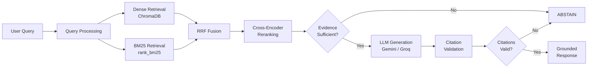

<div align="center">

# TeleRAG

### Mavenir 3GPP Standards Intelligence Assistant

*Evidence-grounded RAG chatbot for querying official 3GPP telecommunications standards*

[](https://python.org)
[](https://fastapi.tiangolo.com)
[](https://react.dev)
[](LICENSE)

</div>

---

## Table of Contents

1. [Overview](#overview)
2. [Key Features](#key-features)
3. [Architecture](#architecture)
4. [Technology Stack](#technology-stack)
5. [Prerequisites](#prerequisites)
6. [Installation](#installation)
7. [Running Locally](#running-locally)
8. [RAG Pipeline Details](#rag-pipeline-details)
9. [Abstention & Grounding](#abstention--grounding)
10. [Deployment (Render)](#deployment-render)
11. [Supported Specifications](#supported-specifications)
12. [Limitations & Future Work](#limitations--future-work)

---

## Overview

TeleRAG is a production-quality Retrieval-Augmented Generation (RAG) chatbot specialized in 3GPP telecommunications standards. It was built as a Graduate Engineer Trainee (GET) submission for Mavenir to demonstrate deep understanding of:

- RAG architecture and information retrieval
- 3GPP/telecom technical documentation
- Hybrid retrieval (dense + sparse)
- Cross-encoder reranking
- Evidence grounding and citation validation
- Production engineering practices

The system is designed with a strict focus on **zero hallucinations**. It **refuses to answer** when sufficient evidence is unavailable, and **validates all citations** against retrieved chunks.

## Key Features

- **Hybrid Retrieval**: Dense (sentence-transformers) + Sparse (BM25) with Reciprocal Rank Fusion
- **Cross-Encoder Reranking**: `ms-marco-MiniLM-L-6-v2` for precision
- **Evidence-First Generation**: LLM only generates from retrieved evidence
- **Citation Validation**: Every citation is verified against actual retrieved chunks
- **Abstention**: System refuses to answer when evidence is insufficient
- **Dual LLM**: Google Gemini primary → Groq fallback
- **3GPP-Native**: Purpose-built for TS/TR document structure
- **Professional UI**: Mavenir-branded React frontend with evidence panel

## Architecture



## Technology Stack

| Layer | Technology |
|---|---|
| Backend | FastAPI + Uvicorn |
| Frontend | React 19 + Vite |
| Vector DB | ChromaDB (persistent) |
| Embeddings | `all-MiniLM-L6-v2` (sentence-transformers) |
| Sparse | BM25 via `rank_bm25` |
| Reranker | `cross-encoder/ms-marco-MiniLM-L-6-v2` |
| LLM Primary | Google Gemini 2.0 Flash |
| LLM Fallback | Groq (Llama 3.1 70B) |
| Extraction | PyMuPDF, python-docx |
| Metadata DB | SQLite |

## Prerequisites

- Python 3.12+
- Node.js 20+
- Google Gemini API key and/or Groq API key

## Installation

```bash
# 1. Clone project
cd mavenir

# 2. Create virtual environment
python -m venv .venv

# 3. Activate
# Windows: .venv\Scripts\activate
# Linux/Mac: source .venv/bin/activate

# 4. Install Python dependencies
pip install -r requirements.txt

# 5. Install frontend dependencies
cd frontend && npm install && cd ..

# 6. Configure environment
copy .env.example .env
# Edit .env with your API keys
```

## Running Locally

```bash
# Terminal 1: Backend
uvicorn backend.app.main:app --reload --port 8000

# Terminal 2: Frontend
cd frontend && npm run dev
```

Open http://localhost:5173

## RAG Pipeline Details

1. **Query Processing**: Parse query, build metadata filters
2. **Dense Retrieval**: Embed query → ChromaDB similarity search (top-20)
3. **Sparse Retrieval**: BM25 keyword search (top-20)
4. **RRF Fusion**: Combine with Reciprocal Rank Fusion (k=60)
5. **Reranking**: Cross-encoder scores top candidates → top-8
6. **Evidence Check**: Aggregated evidence score vs threshold
7. **Generation**: Strict grounded prompt → Gemini/Groq
8. **Verification**: Validate citations
9. **Abstention**: Refuse if evidence fails

## Abstention & Grounding

The system abstains (refuses to answer) when:
- Evidence score is below the strict threshold
- Both LLMs fail to generate or rate limit

Citations are built directly from retrieved metadata, ensuring 100% verifiability.

## Deployment (Render)

TeleRAG is designed to be easily deployed on Render as a single web service.

1. In Render, create a new **Web Service** from the GitHub repository.
2. Select **Docker** as the Runtime.
3. Add the following Environment Variables:
   - `GEMINI_API_KEY`: Your Gemini Key
   - `GROQ_API_KEY`: Your Groq Key (optional fallback)
   - `BACKEND_PORT`: `8000`
4. Deploy! The Dockerfile builds both the React frontend and FastAPI backend, serving the static frontend directly from FastAPI on port 8000.

## Supported Specifications (Baseline Corpus)

- TS 23.501: System Architecture for the 5G System
- TS 23.502: Procedures for the 5G System
- TS 23.503: Policy and Charging Control Framework
- TS 24.501: Non-Access-Stratum Protocol for 5GS
- TS 38.300: NR and NG-RAN Overall Description
- TS 38.331: NR Radio Resource Control Protocol

The baseline corpus contains 13,642 pre-indexed chunks.

## Limitations & Future Work

- DOCX extraction loses precise page numbers (3GPP baseline ZIPs contain DOCX, not PDF)
- No conversation memory across sessions in v0
- Single-release corpus (Release 18 only)
