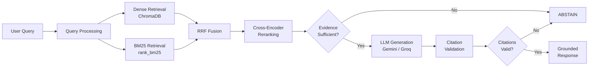

<div align="center">

# TeleRAG

### Mavenir 3GPP Standards Intelligence Assistant

*Evidence-grounded RAG chatbot for querying official 3GPP telecommunications standards*

[](https://python.org)
[](https://fastapi.tiangolo.com)
[](https://react.dev)
[](LICENSE)

</div>

---

## Table of Contents

1. [Overview](#overview)
2. [Key Features](#key-features)
3. [Architecture](#architecture)
4. [Technology Stack](#technology-stack)
5. [Project Structure](#project-structure)
6. [Prerequisites](#prerequisites)
7. [Installation](#installation)
8. [Configuration](#configuration)
9. [Corpus Preparation](#corpus-preparation)
10. [Running Locally](#running-locally)
11. [API Reference](#api-reference)
12. [Frontend](#frontend)
13. [RAG Pipeline Details](#rag-pipeline-details)
14. [Hybrid Retrieval](#hybrid-retrieval)
15. [Reranking](#reranking)
16. [Grounding & Citation Validation](#grounding--citation-validation)
17. [Claim Verification](#claim-verification)
18. [Abstention Logic](#abstention-logic)
19. [Evaluation Framework](#evaluation-framework)
20. [Deployment](#deployment)
21. [Environment Variables](#environment-variables)
22. [Supported Specifications](#supported-specifications)
23. [3GPP Version Naming](#3gpp-version-naming)
24. [Limitations](#limitations)
25. [Performance](#performance)
26. [Security](#security)
27. [Troubleshooting](#troubleshooting)
28. [Contributing](#contributing)
29. [License](#license)

---

## Overview

TeleRAG is a production-quality v0 prototype for a Retrieval-Augmented Generation (RAG) chatbot specialized in 3GPP telecommunications standards. It is designed for Graduate Engineer Trainees (GETs) at Mavenir to demonstrate deep understanding of:

- RAG architecture and information retrieval
- 3GPP/telecom technical documentation
- Hybrid retrieval (dense + sparse)
- Cross-encoder reranking
- Evidence grounding and citation validation
- Claim verification and abstention
- Production engineering practices

The system **refuses to answer** when sufficient evidence is unavailable, and **validates all citations** against retrieved chunks to minimize hallucination.

## Key Features

- **Hybrid Retrieval**: Dense (sentence-transformers) + Sparse (BM25) with Reciprocal Rank Fusion
- **Cross-Encoder Reranking**: `ms-marco-MiniLM-L-6-v2` for precision
- **Evidence-First Generation**: LLM only generates from retrieved evidence
- **Citation Validation**: Every `[CHUNK_ID]` is verified against actual retrieved chunks
- **Abstention**: System refuses to answer when evidence is insufficient
- **Dual LLM**: Google Gemini primary → Groq fallback
- **3GPP-Native**: Purpose-built for TS/TR document structure
- **Professional UI**: Mavenir-branded React frontend with evidence panel

## Architecture



## Technology Stack

| Layer | Technology |
|---|---|
| Backend | FastAPI + Uvicorn |
| Frontend | React 19 + Vite |
| Vector DB | ChromaDB (persistent) |
| Embeddings | `all-MiniLM-L6-v2` (sentence-transformers) |
| Sparse | BM25 via `rank_bm25` |
| Reranker | `cross-encoder/ms-marco-MiniLM-L-6-v2` |
| LLM Primary | Google Gemini 2.0 Flash |
| LLM Fallback | Groq (Llama 3.1 70B) |
| PDF Extraction | PyMuPDF |
| DOCX Extraction | python-docx |
| Metadata DB | SQLite |

## Project Structure

```
mavenir/
├── backend/
│   └── app/
│       ├── api/             # FastAPI routes
│       ├── evaluation/      # Metrics & evaluation runner
│       ├── generation/      # LLM clients (Gemini, Groq, Gateway)
│       ├── ingestion/       # Download, inspect, extract, chunk
│       ├── models/          # Pydantic schemas
│       ├── reranking/       # Cross-encoder reranker
│       ├── retrieval/       # Dense, BM25, RRF, filters
│       ├── services/        # Query orchestrator, corpus manager
│       ├── storage/         # ChromaDB, SQLite wrappers
│       ├── verification/    # Claims, citations, abstention
│       ├── config.py        # Settings from .env
│       └── main.py          # FastAPI app entry
├── frontend/                # React + Vite
├── scripts/
│   └── prepare_corpus.py    # Corpus download & indexing
├── evaluation/
│   └── questions.json       # Curated test questions
├── data/                    # Downloaded 3GPP specs (gitignored)
├── storage/                 # Vector/BM25/metadata indices (gitignored)
├── requirements.txt
├── Dockerfile
├── docker-compose.yml
└── .env.example
```

## Prerequisites

- Python 3.12+
- Node.js 20+
- ~2 GB free disk space
- Google Gemini API key and/or Groq API key

## Installation

```bash
# 1. Clone / navigate to project
cd mavenir

# 2. Create virtual environment
python -m venv .venv

# 3. Activate
# Windows:
.venv\Scripts\activate
# Linux/Mac:
source .venv/bin/activate

# 4. Install Python dependencies
pip install -r requirements.txt

# 5. Install frontend dependencies
cd frontend && npm install && cd ..

# 6. Configure environment
copy .env.example .env
# Edit .env with your API keys
```

## Configuration

Copy `.env.example` to `.env` and set your API keys:

```env
GEMINI_API_KEY=your_gemini_key_here
GROQ_API_KEY=your_groq_key_here
```

All other settings have sensible defaults. See [Environment Variables](#environment-variables) for full list.

## Corpus Preparation

```bash
# Download, extract, chunk, and index the 3GPP Release 18 corpus
python -m scripts.prepare_corpus
```

This will:
1. Download 6 specifications from the official 3GPP archive (~42 MB)
2. Inspect each ZIP to identify the authoritative document
3. Extract text preserving structure
4. Chunk into ~1024-char segments with 128-char overlap
5. Embed and index into ChromaDB
6. Build BM25 index
7. Store metadata in SQLite

## Running Locally

```bash
# Terminal 1: Backend
.venv\Scripts\python -m uvicorn backend.app.main:app --reload --port 8000

# Terminal 2: Frontend
cd frontend && npm run dev
```

Open http://localhost:5173

## API Reference

### `POST /api/query`
Process a RAG query against the 3GPP corpus.

**Request:**
```json
{
  "query": "What is network slicing?",
  "release": "18",
  "specifications": ["TS 23.501", "TS 23.502"]
}
```

**Response:** `QueryResponse` with answer, citations, evidence, grounding status, and latency.

### `GET /api/corpus/status`
Returns corpus indexing status, document counts, chunk counts.

### `GET /api/health`
System health check.

## Frontend

The React frontend provides:
- **Header**: Mavenir branding with system status indicators
- **Sidebar**: Knowledge scope selector, corpus stats, example questions
- **Chat**: Conversation interface with grounding indicators
- **Evidence Panel**: Retrieved chunks, validated citations, pipeline latency

## RAG Pipeline Details

1. **Query Processing**: Parse query, build metadata filters
2. **Dense Retrieval**: Embed query → ChromaDB similarity search (top-20)
3. **Sparse Retrieval**: BM25 keyword search (top-20)
4. **RRF Fusion**: Combine with Reciprocal Rank Fusion (k=60)
5. **Reranking**: Cross-encoder scores top candidates → top-8
6. **Evidence Check**: Aggregated evidence score vs threshold
7. **Generation**: Strict grounded prompt → Gemini/Groq
8. **Verification**: Extract claims, validate citations
9. **Abstention**: Refuse if evidence or citations fail

## Hybrid Retrieval

Combines dense semantic search (understands meaning) with BM25 keyword search (catches exact terms like "AMF", "PDU", "NAS") for superior recall on technical documents.

## Reranking

Cross-encoder (`ms-marco-MiniLM-L-6-v2`) scores each (query, chunk) pair jointly, dramatically improving precision over embedding-only similarity.

## Grounding & Citation Validation

Every `[CHUNK_ID: ...]` in the LLM's answer is validated against the chunks actually retrieved. Hallucinated citations trigger abstention.

## Claim Verification

Claims are extracted from the answer and checked for citation backing. Unsupported claims are flagged.

## Abstention Logic

The system abstains (refuses to answer) when:
- Evidence score is below threshold (0.4)
- Answer contains claims but zero valid citations
- Both LLMs fail to generate

## Evaluation Framework

```bash
python -m backend.app.evaluation.runner
```

Metrics: Recall@K, MRR, Citation Accuracy, Abstention Accuracy.

## Deployment

```bash
# Docker
docker-compose up --build

# Or standalone
docker build -t telerag .
docker run -p 8000:8000 --env-file .env -v ./data:/app/data -v ./storage:/app/storage telerag
```

## Environment Variables

See `.env.example` for complete list with documentation.

## Supported Specifications

| Spec | Title |
|---|---|
| TS 23.501 | System Architecture for the 5G System |
| TS 23.502 | Procedures for the 5G System |
| TS 23.503 | Policy and Charging Control Framework |
| TS 24.501 | Non-Access-Stratum Protocol for 5GS |
| TS 38.300 | NR and NG-RAN Overall Description |
| TS 38.331 | NR Radio Resource Control Protocol |

## 3GPP Version Naming

3GPP archives use `{spec}-{version}.zip` where the version letter encodes the release:
- Release 15 = `f`, 16 = `g`, 17 = `h`, **18 = `i`**, 19 = `j`
- Example: `23501-i00.zip` = TS 23.501 Release 18, version 18.0.0

## Limitations

- v0 prototype — not production-hardened
- DOCX extraction loses precise page numbers (3GPP baseline ZIPs contain DOCX, not PDF)
- No conversation memory across sessions
- Single-release corpus (Release 18 only)
- No streaming responses yet

## Performance

- Embedding: ~13,600 chunks indexed in ~5 minutes
- Query latency: ~2-5s end-to-end (retrieval + reranking + LLM)
- Memory: ~2 GB RAM at runtime

## Security

- API keys are server-side only (never sent to browser)
- `.env` is gitignored
- CORS restricted to frontend origin
- No user authentication in v0

## Troubleshooting

- **"VectorStore not initialized"**: Run `python -m scripts.prepare_corpus` first
- **"GEMINI_API_KEY missing"**: Set in `.env`
- **Slow first query**: Models are loaded on first use; subsequent queries are faster

## Contributing

This is a GET technical assignment prototype. For production use, consider:
- Adding authentication
- Streaming responses
- Multi-release support
- Persistent conversation history
- Rate limiting

## License

MIT
